# Introduction

## Get the Code

- [GitHub Repo](https://github.com/hswong3i/transiting-from-nginx-ingress-to-envoy-gateway): Source code
- [GitHub Page](https://hswong3i.github.io/metrics-logs-traces-and-profiles-grafana-lgtm): Online [reveal.js](https://revealjs.com/), converted by [pandoc](https://pandoc.org)
- [index.pdf](index.pdf): Offline PDF, converted by [pandoc](https://pandoc.org)

------------------------------------------------------------------------

## About Me

- Wong Hoi Sing, Edison (hswong3i)
- 2005: [Drupal, Developer & Contributor](https://drupal.org/user/33940)
- 2008: [HKDUG, Founder](https://groups.drupal.org/drupalhk)
- 2010: [PantaRei Design, Founder](https://pantarei-design.com)
- 2020: [HKOSCON 2020, Speaker](https://hkoscon.org/2020/topics/ansible-vm-kubernetes)
- 2021: [AlviStack, Founder](https://landscape.cncf.io/?group=certified-partners-and-providers&item=platform--certified-kubernetes-installer--alvistack-vagrant-box-packaging-for-kubernetes)
- 2022: [HKOSCON 2022, Speaker](https://2022.hkoscon.org/edisonwong)
- 2024: [HKOSCON 2024, Speaker](https://hkoscon.org/2024/topic/metrics-logs-traces-and-profiles-grafana-lgtm/)
- 2026: [Most Active GitHub user in Hong Kong](https://github.com/gayanvoice/top-github-users/blob/main/markdown/total_contributions/hong_kong.md)

------------------------------------------------------------------------

------------------------------------------------------------------------

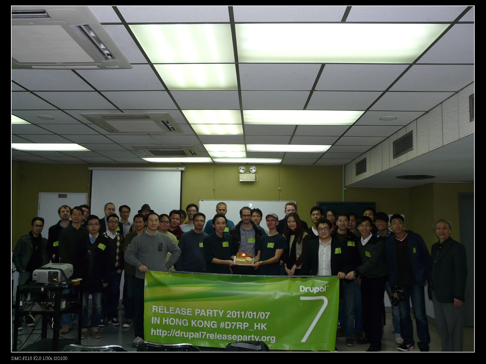

------------------------------------------------------------------------

------------------------------------------------------------------------

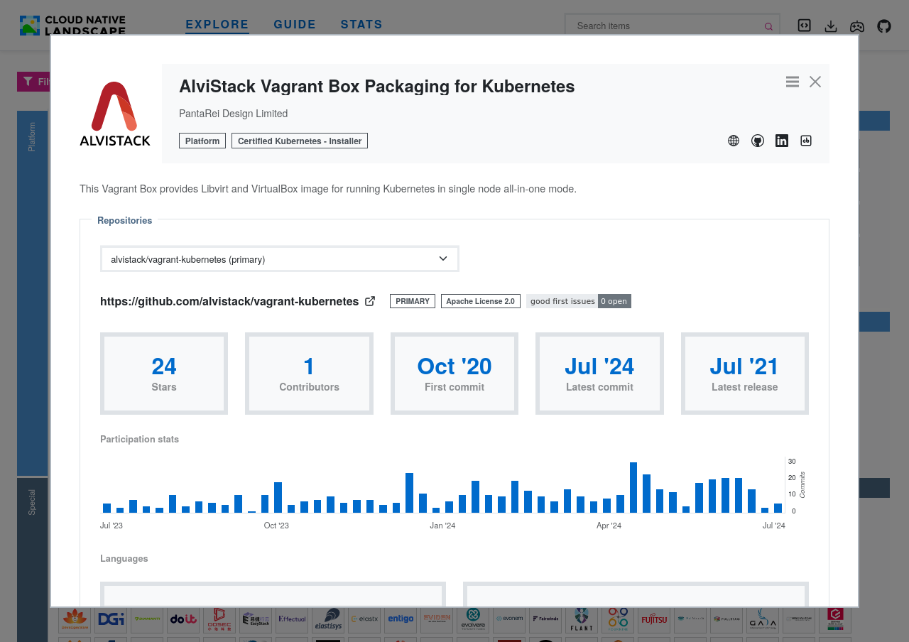

------------------------------------------------------------------------

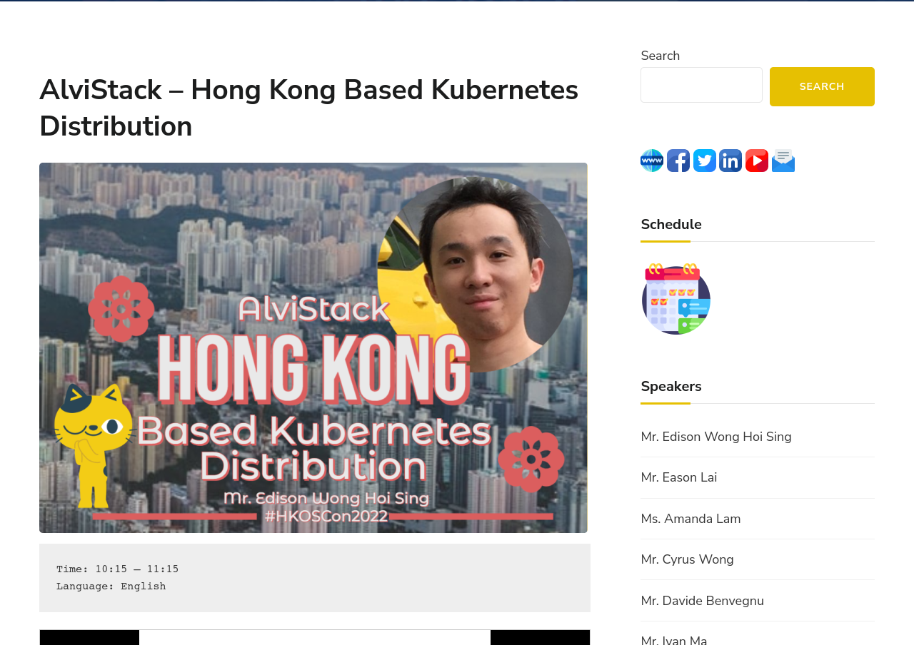

------------------------------------------------------------------------

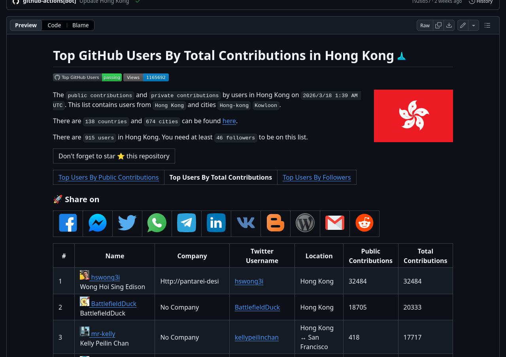

# What is Gateway API?

## About Ingress NGINX

- Ingress is the original user-friendly way to direct network traffic to workloads running on Kubernetes
- In order for an Ingress to work in your cluster, there must be an Ingress controller running
- Ingress NGINX was an Ingress controller, one of the most popular, deployed as part of many hosted Kubernetes platforms

------------------------------------------------------------------------

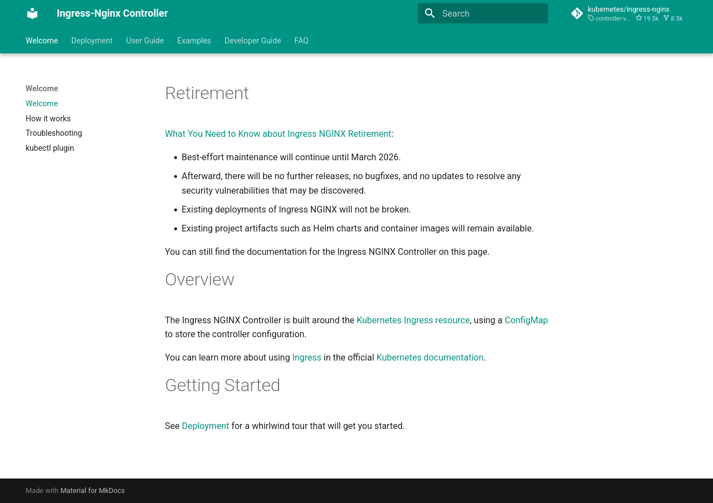

## Ingress NGINX Retirement

- For years, the project has had only one or two people doing development work
- Last year, the Ingress NGINX maintainers announced their plans to wind down Ingress NGINX
- In March 2026, Ingress NGINX maintenance will be halted, and the project will be retired
- Existing deployments of Ingress NGINX will not be broken

------------------------------------------------------------------------

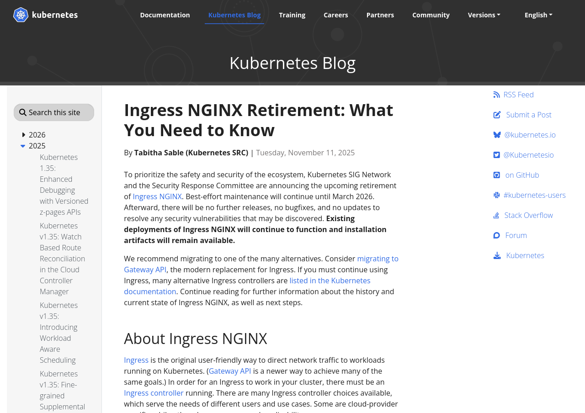

## About Gateway API

- Gateway API is an official Kubernetes project focused on L4 and L7 routing in Kubernetes
- Next generation of Kubernetes Ingress, Load Balancing, and Service Mesh APIs
- Designed to be generic, expressive, and role-oriented

------------------------------------------------------------------------

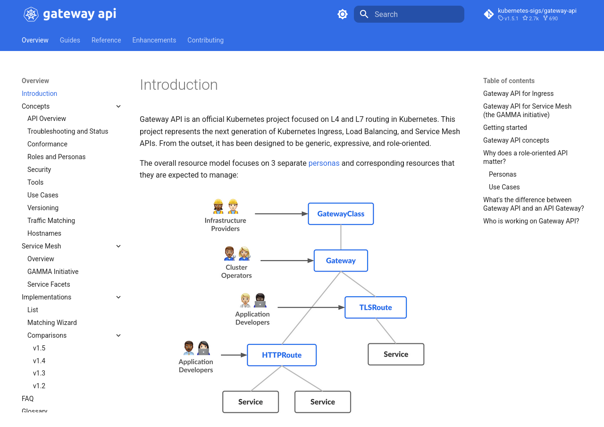

------------------------------------------------------------------------

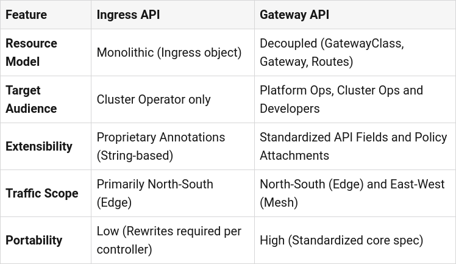

------------------------------------------------------------------------

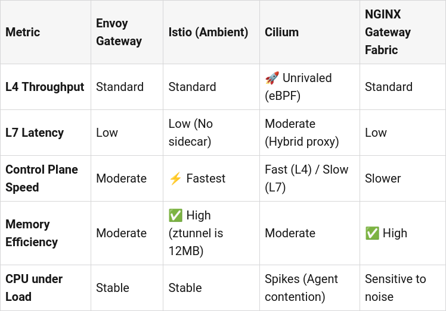

------------------------------------------------------------------------

## About NGINX Gateway Fabric

- NGINX Gateway Fabric provides an implementation of the Gateway API using NGINX as the data plane
- HTTP or TCP/UDP load balancer, reverse proxy, or API gateway for Kubernetes applications

------------------------------------------------------------------------

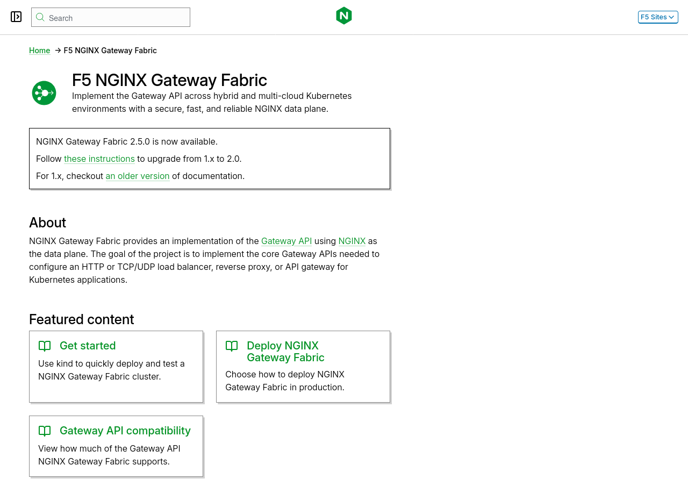

## About Envoy Gateway

- Envoy Gateway is a Kubernetes-native API Gateway and reverse proxy control plane
- Integrating tightly with Kubernetes through the Gateway API
- Providing custom CRDs for advanced traffic policies
- Automatically translating Kubernetes resources into Envoy config
- Managing the lifecycle of Envoy Proxy instances

------------------------------------------------------------------------

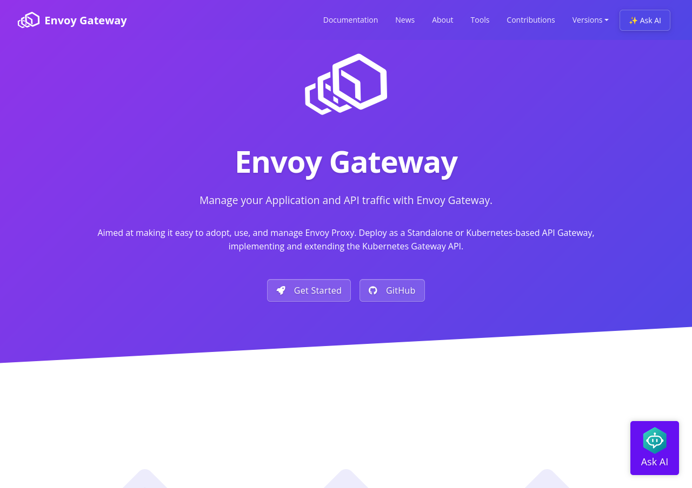

# Q&A

## References

- [Kubernetes Gateway API in 2026: The Definitive Guide to Envoy Gateway, Istio, Cilium and Kong](https://dev.to/mechcloud_academy/kubernetes-gateway-api-in-2026-the-definitive-guide-to-envoy-gateway-istio-cilium-and-kong-2bkl)
- [Kubernetes Gateway API 网关选型全景对比](https://zhuanlan.zhihu.com/p/1922971833201850292)
- [生产级无坑指南：五分钟上手 Envoy Gateway，替代 Nginx Ingress 的终极方案！](https://www.51cto.com/article/835282.html)

## Contact Me

- Address: Unit 326, 3/F, Building 16W, No.16 Science Park West Avenue, Hong Kong Science Park, Shatin, N.T.
- Phone: +852 3576 3812
- Fax: +852 3753 3663
- Email: <sales@pantarei-design.com>
- Web: <http://pantarei-design.com>
