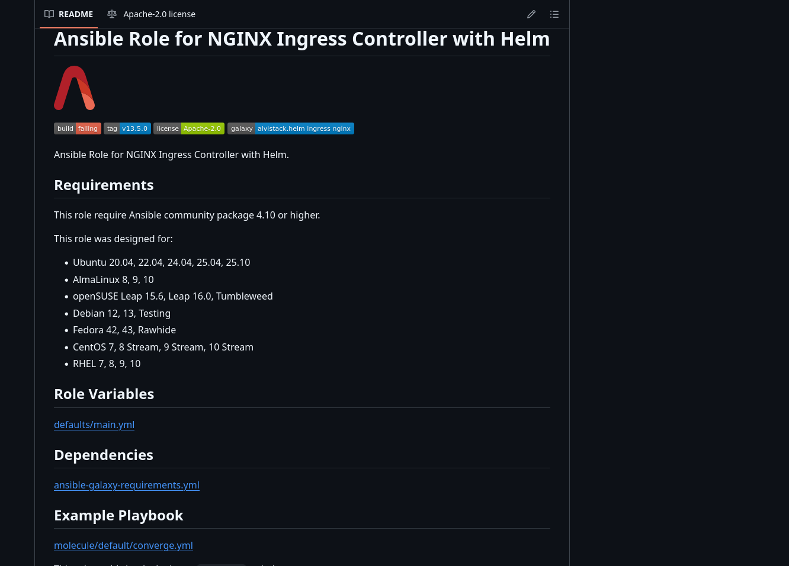
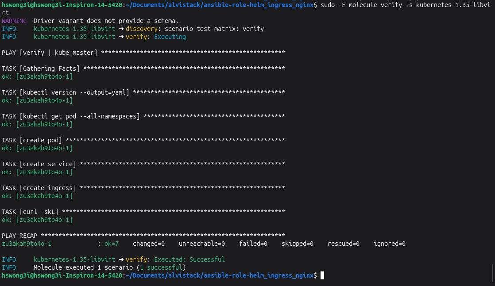
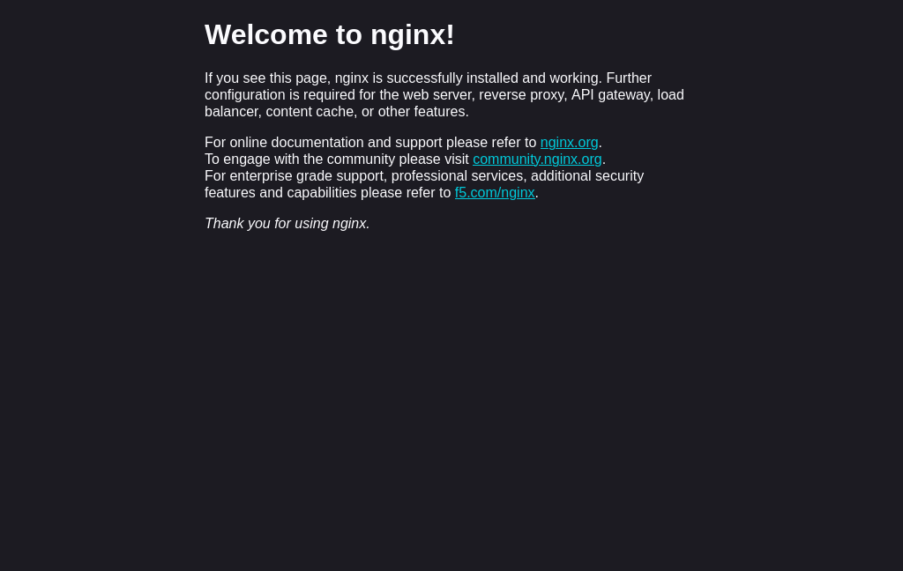
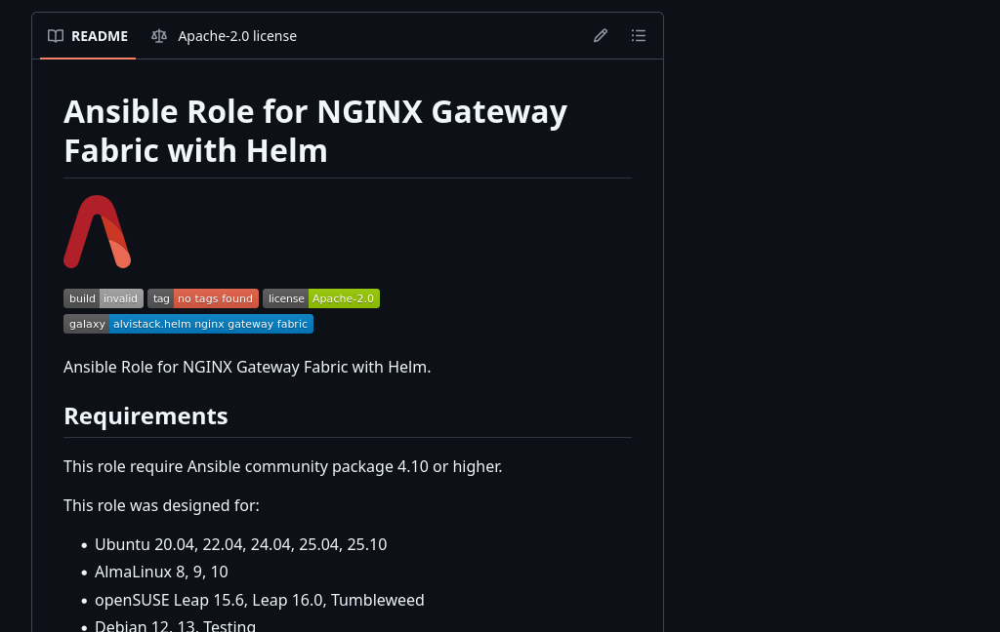
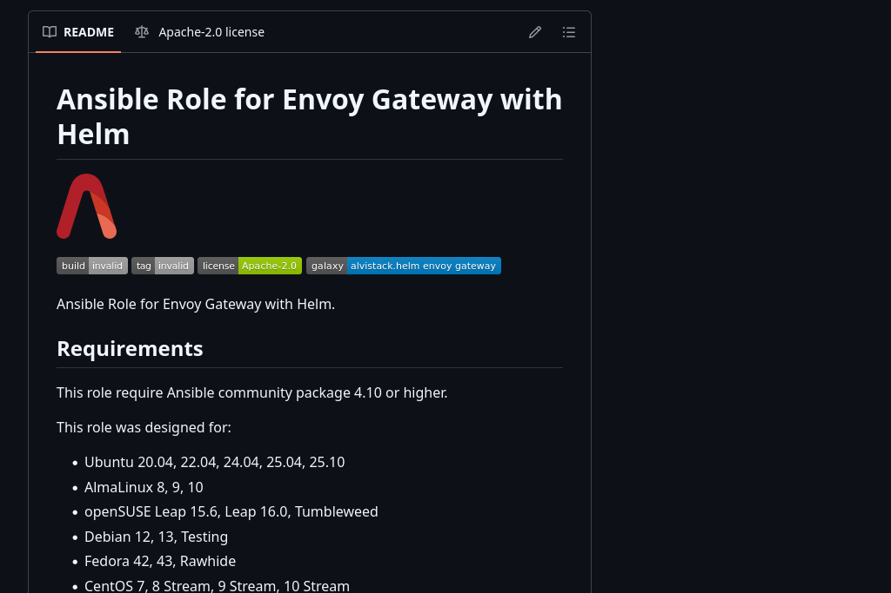

# Introduction

## Get the Code

- [GitHub Repo](https://github.com/hswong3i/transiting-from-nginx-ingress-to-envoy-gateway): Source code
- [GitHub Page](https://hswong3i.github.io/transiting-from-nginx-ingress-to-envoy-gateway): Online [reveal.js](https://revealjs.com/), converted by [pandoc](https://pandoc.org)

------------------------------------------------------------------------

## About Me

- Wong Hoi Sing, Edison (hswong3i)
- 2005: [Drupal, Developer & Contributor](https://drupal.org/user/33940)
- 2008: [HKDUG, Founder](https://groups.drupal.org/drupalhk)
- 2010: [PantaRei Design, Founder](https://pantarei-design.com)
- 2020: [HKOSCON 2020, Speaker](https://hkoscon.org/2020/topics/ansible-vm-kubernetes)
- 2021: [AlviStack, Founder](https://landscape.cncf.io/?group=certified-partners-and-providers&item=platform--certified-kubernetes-installer--alvistack-vagrant-box-packaging-for-kubernetes)
- 2022: [HKOSCON 2022, Speaker](https://2022.hkoscon.org/edisonwong)
- 2024: [HKOSCON 2024, Speaker](https://hkoscon.org/2024/topic/metrics-logs-traces-and-profiles-grafana-lgtm/)
- 2026: [Most Active GitHub user in Hong Kong](https://github.com/gayanvoice/top-github-users/blob/main/markdown/total_contributions/hong_kong.md)

------------------------------------------------------------------------

------------------------------------------------------------------------

------------------------------------------------------------------------

------------------------------------------------------------------------

------------------------------------------------------------------------

------------------------------------------------------------------------

# What is Gateway API?

## About Ingress NGINX

- Ingress is the original user-friendly way to direct network traffic to workloads running on Kubernetes
- In order for an Ingress to work in your cluster, there must be an Ingress controller running
- Ingress NGINX was an Ingress controller, one of the most popular, deployed as part of many hosted Kubernetes platforms

------------------------------------------------------------------------

## Ingress NGINX Retirement

- For years, the project has had only one or two people doing development work
- Last year, the Ingress NGINX maintainers announced their plans to wind down Ingress NGINX
- In March 2026, Ingress NGINX maintenance will be halted, and the project will be retired
- Existing deployments of Ingress NGINX will not be broken

------------------------------------------------------------------------

## About Gateway API

- Gateway API is an official Kubernetes project focused on L4 and L7 routing in Kubernetes
- Next generation of Kubernetes Ingress, Load Balancing, and Service Mesh APIs
- Designed to be generic, expressive, and role-oriented

------------------------------------------------------------------------

------------------------------------------------------------------------

------------------------------------------------------------------------

------------------------------------------------------------------------

## About NGINX Gateway Fabric

- NGINX Gateway Fabric provides an implementation of the Gateway API using NGINX as the data plane
- HTTP or TCP/UDP load balancer, reverse proxy, or API gateway for Kubernetes applications

------------------------------------------------------------------------

## About Envoy Gateway

- Envoy Gateway is a Kubernetes-native API Gateway and reverse proxy control plane
- Integrating tightly with Kubernetes through the Gateway API
- Providing custom CRDs for advanced traffic policies
- Automatically translating Kubernetes resources into Envoy config
- Managing the lifecycle of Envoy Proxy instances

------------------------------------------------------------------------

## References

- <https://kubernetes.github.io/ingress-nginx>
- <https://kubernetes.io/blog/2025/11/11/ingress-nginx-retirement>
- <https://gateway-api.sigs.k8s.io>
- <https://docs.nginx.com/nginx-gateway-fabric>
- <https://gateway.envoyproxy.io>

# Ingress NGINX

## Demo

- Ansible Role for NGINX Ingress Controller with Helm
- Default with `hostNetwork: true`
- Listen to TCP/80 and TCP/443
- <https://github.com/alvistack/ansible-role-helm_ingress_nginx>

------------------------------------------------------------------------

------------------------------------------------------------------------

    # Deploy the demo with Ansible + Vagrant + Kubernetes 1.35
    sudo -E molecule converge -s kubernetes-1.35-libvirt

    # Verify the deployment result
    sudo -E molecule verify -s kubernetes-1.35-libvirt

------------------------------------------------------------------------

    # /etc/kubernetes/charts/ingress-nginx.values.yaml
    ---
    controller:
      dnsPolicy: ClusterFirstWithHostNet
      reportNodeInternalIp: true
      hostNetwork: true
      hostPort:
        enabled: true
        ports:
          http: 80
          https: 443
      service:
        type: NodePort

------------------------------------------------------------------------

    # /etc/kubernetes/namespaces/default/ingress-nginx.yml
    ---
    apiVersion: networking.k8s.io/v1
    kind: Ingress
    metadata:
      name: ingress-nginx
      namespace: default
    spec:
      ingressClassName: nginx
      rules:
        - http:
            paths:
              - path: /
                pathType: Prefix
                backend:
                  service:
                    name: nginx
                    port:
                      number: 80

------------------------------------------------------------------------

------------------------------------------------------------------------

# NGINX Gateway Fabric

## Demo

- Ansible Role for NGINX Gateway Fabric with Helm
- Default with `hostNetwork: true`
- Listen to TCP/80 and TCP/443
- <https://github.com/alvistack/ansible-role-helm_nginx_gateway_fabric>

------------------------------------------------------------------------

------------------------------------------------------------------------

    # Deploy the demo with Ansible + Vagrant + Kubernetes 1.35
    sudo -E molecule converge -s kubernetes-1.35-libvirt

    # Verify the deployment result
    sudo -E molecule verify -s kubernetes-1.35-libvirt

------------------------------------------------------------------------

    # /etc/kubernetes/charts/nginx-gateway-fabric.values.yaml
    ---
    nginx:
      patches:
        - type: StrategicMerge
          value:
            spec:
              template:
                spec:
                  hostNetwork: true
                  dnsPolicy: ClusterFirstWithHostNet
                  securityContext:
                    allowPrivilegeEscalation: true
                    privileged: true
                    sysctls: []
                  containers:
                    - name: nginx
                      securityContext:
                        allowPrivilegeEscalation: true
                        privileged: true
                        sysctls: []
      service:
        type: NodePort

------------------------------------------------------------------------

    # /etc/kubernetes/namespaces/nginx-gateway/gateway-nginx-gateway.yml
    ---
    apiVersion: gateway.networking.k8s.io/v1
    kind: Gateway
    metadata:
      name: nginx-gateway
      namespace: nginx-gateway
    spec:
      gatewayClassName: nginx
      allowedListeners:
        namespaces:
          from: All
      listeners:
        - name: http
          protocol: HTTP
          port: 80
          allowedRoutes:
            namespaces:
              from: All

------------------------------------------------------------------------

    # /etc/kubernetes/namespaces/default/httproute-nginx-gateway.yml
    ---
    apiVersion: gateway.networking.k8s.io/v1
    kind: HTTPRoute
    metadata:
      name: nginx-gateway
      namespace: default
    spec:
      parentRefs:
        - name: nginx-gateway
          namespace: nginx-gateway
      rules:
        - matches:
          - path:
              type: PathPrefix
              value: /
          backendRefs:
            - name: nginx
              port: 80

# Envoy Gateway

## Demo

- Ansible Role for Envoy Gateway with Helm
- (WIP, default with LoadBalancer) Default with `hostNetwork: true`
- (WIP, default with TCP/3xxxx) Listen to TCP/80 and TCP/443
- <https://github.com/alvistack/ansible-role-helm_envoy_gateway>

------------------------------------------------------------------------

------------------------------------------------------------------------

    # Deploy the demo with Ansible + Vagrant + Kubernetes 1.35
    sudo -E molecule converge -s kubernetes-1.35-libvirt

    # Verify the deployment result
    sudo -E molecule verify -s kubernetes-1.35-libvirt

------------------------------------------------------------------------

    # /etc/kubernetes/namespacce/envoy-gateway-system/gatewayclass-envoy-gateway.yml
    apiVersion: gateway.networking.k8s.io/v1
    kind: GatewayClass
    metadata:
      name: envoy-gateway
    spec:
      controllerName: gateway.envoyproxy.io/gatewayclass-controller

------------------------------------------------------------------------

    # /etc/kubernetes/namespaces/envoy-gateway-system/gateway-envoy-gateway.yml
    apiVersion: gateway.networking.k8s.io/v1
    kind: Gateway
    metadata:
      name: envoy-gateway
      namespace: envoy-gateway-system
    spec:
      gatewayClassName: envoy-gateway
      allowedListeners:
        namespaces:
          from: All
      listeners:
        - name: http
          protocol: HTTP
          port: 80
          allowedRoutes:
            namespaces:
              from: All

------------------------------------------------------------------------

    # /etc/kubernetes/namespaces/default/httproute-envoy-gateway.yml
    apiVersion: gateway.networking.k8s.io/v1
    kind: HTTPRoute
    metadata:
      name: envoy-gateway
      namespace: default
    spec:
      parentRefs:
        - name: envoy-gateway
          namespace: envoy-gateway-system
      rules:
        - matches:
          - path:
              type: PathPrefix
              value: /
          backendRefs:
            - name: nginx
              port: 80

# Q&A

## References

- <https://dev.to/mechcloud_academy/kubernetes-gateway-api-in-2026-the-definitive-guide-to-envoy-gateway-istio-cilium-and-kong-2bkl>
- <https://zhuanlan.zhihu.com/p/1922971833201850292>
- <https://www.51cto.com/article/835282.html>

## Contact Me

- Address: Room 547-21, 5/F Building 19W, 19 Science Park West Avenue, Hong Kong Science Park, Shatin, N.T.
- Phone: +852 3576 3812
- Fax: +852 3753 3663
- Email: <sales@pantarei-design.com>
- Web: <http://pantarei-design.com>
